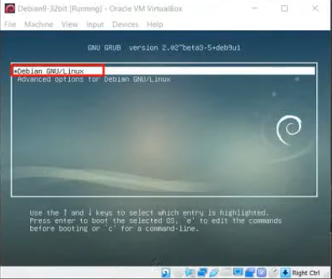

## BIOS

BIOS is the firmware that starts when you power on the computer.

It:

- Performs hardware checks (POST)
    
- Checks CPU, RAM, GPU, and hard disk
    
- Then executes the boot loader from the disk (via MBR in legacy systems)
    

---

## MBR

MBR stands for **Master Boot Record**.

It:

- Contains information about the boot loader
    
- Loads and executes the boot loader (usually GRUB)
    

---

## GRUB

GRUB is the boot loader.

It:

- Displays a splash screen
    
- Allows you to choose the OS or kernel
    
- Then loads and executes the Linux Kernel
    

---

## Kernel

The Kernel is the core of the operating system.

It:

- Mounts the file systems (makes partitions accessible)
    
- Loads drivers
    
- Starts the init system
    

Mount → means making partitions accessible to the system.

After that, it determines the run level (or system target) and starts the required programs.

---

# RunLevel

RunLevel determines which services and programs start.

Each run level represents a different operating mode of the system.

---

# Linux Run Levels (Traditional SysV)

0 → Halt  
1 → Single-user mode (rescue mode)  
2 → Multi-user mode (no GUI, user definable in some systems)  
3 → Full multi-user text mode  
4 → Not used (user definable)  
5 → Full multi-user graphical mode  
6 → Reboot

---

## 0 – Halt

Means shutdown.

---

## 1 – Single-user mode

- Used by one user (root)
    
- Text mode only
    
- Used for maintenance and recovery
    

---

## 2 – User definable

In some systems, it is similar to run level 3.  
It can be customized.

---

## 3 – Full multi-user text mode

- Text mode
    
- Multiple users can log in
    
- Commonly used in servers
    

---

## 4 – User definable

Usually not used by default.  
Can be customized.

---

## 5 – Full multi-user graphical mode

- GUI mode
    
- Normal desktop usage
    

---

## 6 – Reboot

Restarts the device.

---

# RunLevel Commands

Most of these commands require administrator privileges.

Use:

`sudo command`

---

## Get Current RunLevel

`runlevel`

---

## Get Default RunLevel (systemd systems)

`systemctl get-default`

---

## Set Default RunLevel (systemd systems)

`sudo systemctl set-default runlevelX.target`

Replace `X` with the desired run level number.

---

> [!CAUTION]  
> Do NOT set run level to 0 or 6 as default.
> 
> 0 → System will shut down after boot.  
> 6 → System will continuously reboot.

---

## List Services at Specific RunLevel (SysV systems)

`ls /etc/rcX.d`

Replace `X` with the run level number.

Output:

- `S` → Start at boot
    
- `K` → Kill (stop) at boot
