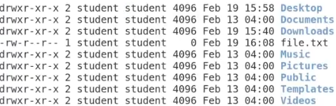

## Permission Groups

There are three permission groups:

- **Owner (u)**
    
- **Group (g)**
    
- **Others (o)**
    
- **All (a)** → means (u + g + o)
    

---

## Permission Types

|Permission|Character|Number|
|---|---|---|
|Read|r|4|
|Write|w|2|
|Execute|x|1|

---

## Details

You can change the permission of any file in two ways.

First, remember the long list format using:

`ls -l`

The output looks like this:

---

### First Character of the Line

The first character can be:

- `l` → link (shortcut)
    
- `d` → directory
    
- `-` → regular file
    

---

### The Next 9 Characters (3 × 3)

After the first character, there are **9 permission characters** divided into three groups:

- First 3 → permissions of the **owner**
    
- Second 3 → permissions of the **group**
    
- Third 3 → permissions of **others**
    

Example:

`-rw------- 1 student student 0 Feb 19 16:08 file.txt`

- `student` (first) → owner name
    
- `student` (second) → group name
    

Now you can understand the file details.

---

# Change Permission

General format:

`chmod role +/- permission file_name`

Example file:

`-rw------- 1 student student 0 Feb 19 16:08 file.txt`

If we want to:

- Give execute permission to owner
    
- Give read and write permissions to group and others
    

---

## Method 1: Using Characters

`chmod u+rwx file.txt chmod go+rw file.txt`

You can mix between `u`, `g`, and `o`.

To remove permission, use `-`.

Example:

`chmod o-r file.txt`

---

## Method 2: Using Numbers (Octal Mode)

`chmod 766 file.txt`

There are three numbers:

- First → owner
    
- Second → group
    
- Third → others
    

---

### Permission Numbers Table

|Number|Permission|
|---|---|
|7|read + write + execute|
|6|read + write|
|5|read + execute|
|4|read|
|3|write + execute|
|2|write|
|1|execute|
|0|no permission|
