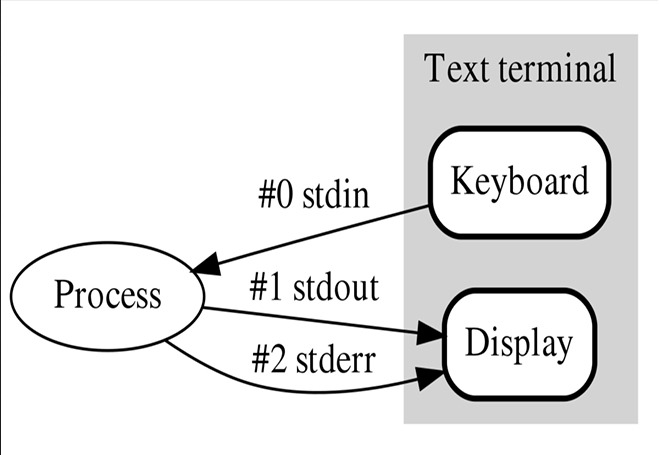

# Redirection

In Linux, every process has three standard streams:

`STDIN   = 0   → Input   STDOUT  = 1   → Output   STDERR  = 2   → Error`

---

## How It Works

When you run a command in the terminal, there are two possible outputs:

### 1️⃣ Correct Output (STDOUT = 1)

`whoami`

Example output:

`kali`

This is standard output (1).

---

### 2️⃣ Error Output (STDERR = 2)

`lsa`

Example output:

`bash: lsa: command not found`

This is error output (2).

---

## Redirecting Output

To redirect output into a file, use:

`>`

Example:

`ls -al > a.txt`

This command writes the standard output (1) into `a.txt`.

---

## Explicit STDOUT

`whoami > a.txt`

is the same as:

`whoami 1> a.txt`

Because `>` redirects STDOUT by default.

---

## Redirecting Errors

To redirect errors:

`2>`

Example:

`ay7aga 2> err.txt`

Since the command is wrong, the error message is written into `err.txt`.

---

## Redirecting Input

The `<` symbol is used for input redirection.

Example:

`wc < a.txt`

is the same as:

`wc 0< a.txt`

This sends the content of `a.txt` as input (STDIN = 0) to the `wc` command.

---

## Appending Output

If you run:

`whoami > a.txt`

The file will be overwritten.

To append instead of overwrite:

`whoami >> a.txt`

This adds the new output to the end of the file.

---

## Redirect STDOUT and STDERR Separately

`ls > out.txt 2> err.txt`

- Standard output → `out.txt`
    
- Errors → `err.txt`
    

---

## Redirect Both to Same File

`ls > all.txt 2>&1`

This sends both STDOUT (1) and STDERR (2) into `all.txt`.

---

# Piping

Piping allows you to send the output of one command as input to another command.

Symbol used:

`|`

---

## Example 1

`ls -l | grep "Desktop"`

- `ls -l` produces output
    
- `grep` receives it as input
    
- It filters lines containing "Desktop"
    

---

## Example 2

`cat a.txt | sort | uniq`

Three commands working together:

1. `cat a.txt` → outputs file content
    
2. `sort` → sorts the content
    
3. `uniq` → removes duplicate lines
    

---

## 🔎 Key Difference

- **Redirection** → Works with files
    
- **Pipe (`|`)** → Works between commands
