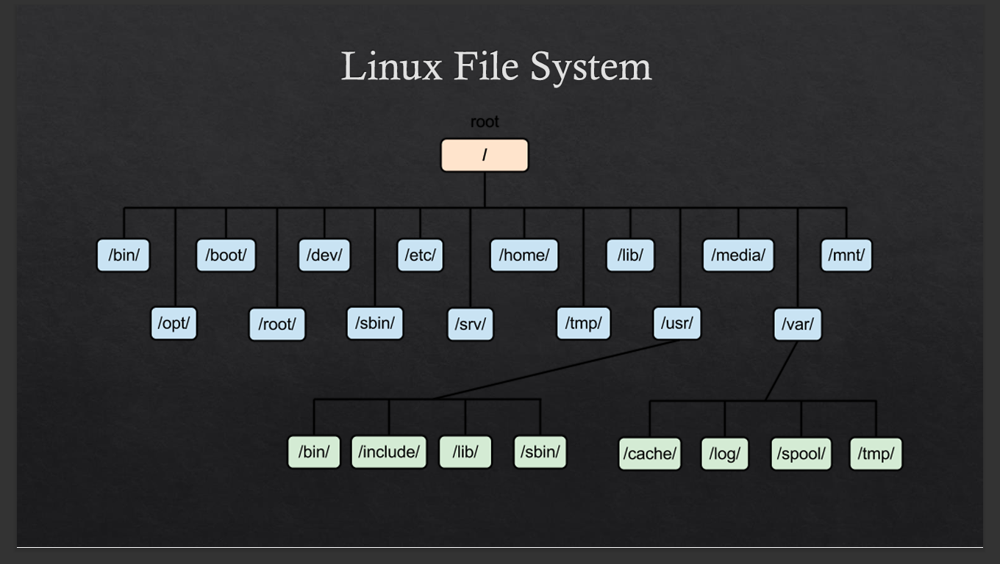

# Services

Services are programs that run automatically by the operating system, not directly by the user.

---

## Services

Services are programs that start automatically when the system boots.

To view services in traditional SysV systems (example run level 5):

`ls /etc/rc5.d`

Output:

You will see many services.  
Some start with **S** and others start with **K**.

- **S** → Service is enabled (started at boot time)
    
- **K** → Service is disabled (not started at boot time)
    

---

## Commands for Services (systemd systems)

Most modern Linux distributions use **systemd**.

### Start a service

`systemctl start apache2`

### Stop a service

`systemctl stop apache2`

### Restart a service

`systemctl restart apache2`

### Check service status

`systemctl status apache2`

### Enable or Disable service at boot time

`systemctl enable apache2`

`systemctl disable apache2`

---

# Linux File System

---

| Directory | Description                                                              |
| --------- | ------------------------------------------------------------------------ |
| `/`       | Root directory. Everything starts from here.                             |
| `/root`   | Home directory of the root user.                                         |
| `/bin`    | Contains essential user binaries (ls, cp, cat).                          |
| `/sbin`   | Contains system binaries (reboot, fdisk, etc.).                          |
| `/etc`    | Contains system configuration files.                                     |
| `/home`   | Home directory for all normal users (/home/student).                     |
| `/boot`   | Contains bootloader and kernel files.                                    |
| `/lib`    | Contains system libraries.                                               |
| `/var`    | Contains variable data (logs, cache, etc.). Example: `/var/log`.         |
| `/usr`    | Contains user programs and secondary binaries (`/usr/bin`, `/usr/sbin`). |
| `/mnt`    | Used to mount external partitions manually.                              |
| `/tmp`    | Temporary files (usually cleared after reboot).                          |
